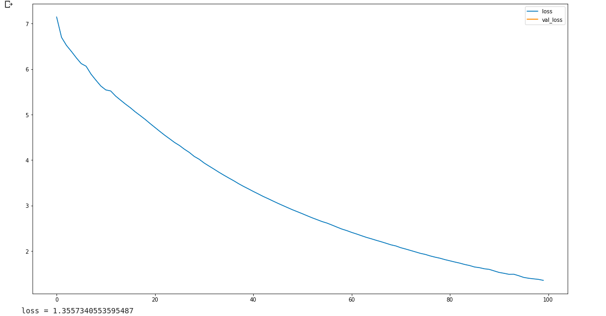

# French-Text-Generator

A word level NLP model. Using this model you can generate french text. Also you can train this model to generate english, spanish and other langages text.
<br/>
This model is build using keras.

## Requirements

<ul>
  <li>python 3.6</li>
  <li>Numpy 1.16.5</li>
  <li>keras 2.2.5</li>
</ul>

## Training the model

```console
python train.py
      -i input_text.txt
      -s sequence_length
      -e epoch_number
      -n save_model_every_n_ep
      -b batch_size
```
#### Example

```console
      python train.py -i les_mesirables_p1.txt -s 50 -e 100 -n 10 -b 128
```

## Loss 

<p align="center">
  
</p>

## Generating French Text

```console
python sample.py 
    -m model_file.h5
    -t tokenizer.pkl
    -w sequence_length
    -s sequences_file
    -i input_text
```

#### Example

```console
    python sample.py -m saved_model_at099.h5 -t tokenizer.pkl -s new_sequences.txt -w 50 -i "je suis"
```


## Results
#### French text
input
```text
je suis
```
output
```text
un homme jambes déléphant en approfondir les mains de dérober en admettons un cri auquel à quarante ans pour cinq heures dabsence trois ans il haussa les épaules létain avait un pourtant qui hallucine on se font désespéré sa nature triste cassette cest peutêtre jamais vue à lâme dépouvante il dit

```
